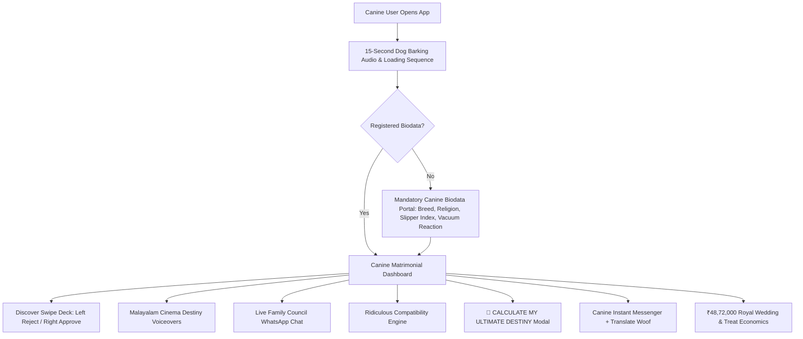

 # PUPPYSHAADI.MATRIMONY 🎯

## Basic Details
### Team Name: 404:PURPOSE NOT FOUND

### Team Members
- Member 1: LEKSHMI S NAIR - ST THOMAS COLLEGE RANNI
- Member 2: ANAMIKA S - ST THOMAS COLLEGE RANNI

### Project Description
The world's most unnecessarily sophisticated matrimonial platform built exclusively for dogs. Where humans are merely mysterious background beings supplying kibble, sofa real estate, and Wi-Fi, while dogs independently navigate high-society arranged marriages, dowry treaties over squeaky ducks, sofa allocation agreements, ancestral bark pedigree checks, and overdramatic Malayalam cinema destiny voiceovers.

### The Problem (that doesn't exist)
Canines across Kerala are suffering from acute matrimonial disenfranchisement. Eligible dogs have smartphones, internet access, and emotional availability, but zero institutional frameworks to negotiate sofa territory, verify ancestral barking lineages, or resolve catastrophic feline ghosting trauma. Humans foolishly believe dogs just want walks, completely oblivious to the fact that their Labrador is undergoing an existential crisis over treat inflation and Grandmother Ammu's compound grass requirements.

### The Solution (that nobody asked for)
A multi-million-dollar-grade matrimonial startup platform (PUPPYSHAADI.MATRIMONY) engineered with royal editorial aesthetics (cream, ivory, gold trim, dark chocolate). We solved dog marriage through:
- **Swipe-to-Match Radar**: Interactive gesture-based card swipe (Swipe Right to Paw Approve ❤️, Swipe Left to Reject ❌ with dynamic comedy stamps and 3D card stack depth).
- **15-Second Dog Barking Audio Engine**: Embedded audio synthesis and real large-dog barking sound on entry/reload with automatic 15-second fade-out.
- **Overdramatic Malayalam Cinema Parody Audio**: Spoken original parody dialogues (*"ഇവനാണോ എന്റെ ജീവിതത്തിലെ ഹീറോ?"*, *"എന്റെ ഹൃദയം പറയുന്നത് ഒന്ന് മാത്രം... ബിസ്കറ്റ് ആദ്യം."*) paired with cinematic trailer stings and subtitles.
- **Mandatory Canine Biodata Onboarding**: Registration gatekeeper capturing candidate Name, Breed, Age, Date of Birth, Canine Religion (e.g. *The Order of The Holy Biscuit*), Family Type, Past Puppies, Slipper Chewing Index, Vacuum Cleaner Reaction, and Human Caretaker Wealth Status.
- **Absurd Compatibility Engine**: Formula: `LOVE SCORE = FUR + FOOD + SOFA + EMOTIONAL + TREAT ECONOMICS + PAWSTROLOGY` with live diagnostic meters.
- **Live Family WhatsApp Council**: Grandmother Ammu, Grandfather Appachan, Sister Chechi, and Cousin Rocky argue over the match in a live animated family chat!
- **🚨 CALCULATE MY ULTIMATE DESTINY**: An 8-stage dramatic scan revealing Bruno (99.73% match) with *"You were meant to bark together"*.
- **Absurd Wedding Planner & Treat Economics**: ₹48,72,000 budget breakdown (featuring ₹18,50,000 royal elephant entry) and Wall Street biscuit inflation tickers.
- **Canine Messenger with "Translate Woof 🐾"**: Direct chat shortcut on every dog profile with psychological woof translation.

## Technical Details
### Technologies/Components Used
For Software:
- **Languages used**: TypeScript, JavaScript, HTML5, CSS3
- **Frameworks used**: React 18, Vite 5, Tailwind CSS
- **Libraries used**: Lucide React, Canvas-Confetti, Web Audio API, Web Speech Synthesis API
- **Tools used**: Node.js, PowerShell, Visual Studio Code / Antigravity

### Implementation
For Software:
# Installation
```bash
# Clone or navigate to the project directory
cd "C:\Users\ANAMIKA S\Desktop\uselessp"

# Install dependencies
npm install
```

# Run
```bash
# Launch development server
npm run dev

# Or 1-Click Launch on Windows Desktop:
# Double click "Launch PUPPYSHAADI.bat" on your Desktop!
```

Open your browser at:
`http://localhost:5173/`

### Project Documentation
For Software:

# Screenshots

*Screenshot 1: The ultra-premium landing page and hero section featuring royal matrimonial candidates, live canine statistics, and the hackathon "Calculate My Ultimate Destiny" trigger.*


*Screenshot 2: Interactive Discover Swipe deck with real-time mouse/touch drag physics, dynamic "PAW APPROVE" / "NOPE" stamps, layered card stack, and direct chat shortcuts.*


*Screenshot 3: Cinematic dog profile modal with overdramatic Malayalam cinema parody voiceover, Love-At-First-Bark compatibility breakdown, red/green flags, and family council verdict.*

# Diagrams

*Canine System Workflow: From initial bark activation and biodata registration through matrimonial swiping, Malayalam cinema audio moments, and family council arbitration.*

## Team Contributions
- **LEKSHMI S NAIR**:
  - Ideation of deliberately useless problem & canine matrimonial satire.
  - Original Malayalam cinema parody scriptwriting & authentic cultural dialogues.
  - Dog dowry negotiation rules, family council character design (Ammu, Appachan, Rocky), and cat trauma therapy protocols.
  - Presentation testing, audio validation, and feature verification.

- **ANAMIKA S**:
  - Full-stack React + TypeScript + Tailwind CSS application architecture.
  - Web Audio API synthesizer (barks, chimes, cinematic stings) and 15-second audio control engine.
  - Touch/mouse card swipe physics with dynamic rotation, stamps, and 3D card stack depth.
  - Algorithmic compatibility calculator, Pawstrology horoscope generator, and PawGPT fake AI logic.
  - LocalStorage persistence, multi-dog chat routing, and build optimization.
